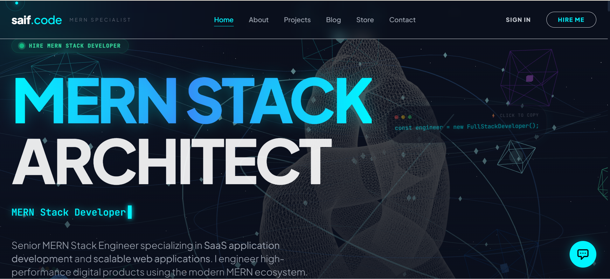
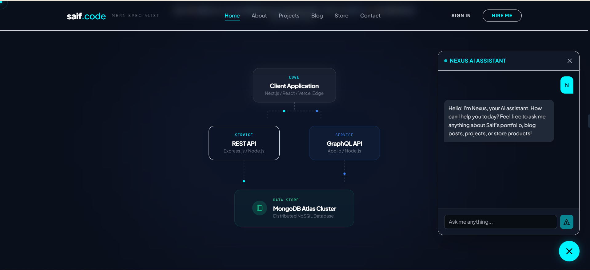
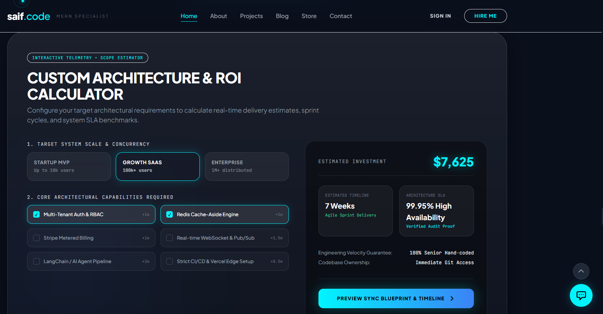

# Full Stack Portfolio — with Multi-Persona AI Assistant

My personal portfolio site, built to showcase my full-stack + AI integration work.
The standout feature: **three separate Gemini-powered AI personas**, each
scoped to a different part of the site.

🔗 **Live:** [saifulislam.vercel.app](https://saifulislam.vercel.app)

## 🤖 AI Personas
| Persona | Purpose |
|---|---|
| 💬 AI Chat Assistant | General Q&A about my background, skills, availability |
| ✍️ Blog Page AI | Context-aware assistant that discusses blog content |
| 📁 Project Page AI | Explains project details, tech choices, and architecture interactively |

Each persona uses a distinct system prompt and context window so responses stay
relevant to the page the visitor is on — not one generic chatbot bolted onto every page.

## 🔥 The "Hire Me Instantly" Features

### 1. 🌌 WebGL/Three.js Interactive Universe
Forget standard hero text. Powered by `react-three-fiber` and physics-based particle simulations, the interface dynamically responds to user interaction. It proves deep understanding of complex front-end engineering, mathematics, and raw performance optimization.

### 2. 🧠 Autonomous AI Persona (Gemini 3.1 Pro)
Why read a resume when you can interview the developer? Integrated with `@google/genai` and Pinecone Vector Database, the built-in AI agent is fine-tuned to my exact architecture decisions, workflows, and personality.
*   *Recruiter prompt:* "How did Saiful solve database indexing optimization?"
*   *AI Response:* Instant, context-aware, technical deep dive.

### 3. 🎬 Cinematic Scroll Storytelling
Powered by `GSAP` and `Lenis`, navigating the platform is a cinematic experience. 3D elements rotate, pin, and morph seamlessly as you scroll, creating a frictionless user journey. 

### 4. ⚡ Zero-Latency Vercel Edge Architecture
Built to break speed limits. By combining Edge caching, aggressive code-splitting, AVIF image optimization, and strict Server-Side Rendering (SSR) via Next.js 16, this platform guarantees blazing-fast interactions.

### 5. 🎛️ Live Analytics & "God Mode" Dashboard
CEOs and Engineering Managers love data. An integrated, secure Admin Dashboard provides live telemetry of the system:
*   Real-time system uptime & latency monitoring.
*   Autonomous SEO schema generation metrics.
*   Token processing throughput and active AI interactions.

---

## 🛠️ Technology Stack & Architecture

### Frontend Architecture
*   **Core:** Next.js 16 (App Router), React 19, TypeScript
*   **3D & Animation:** React Three Fiber, GSAP, Lenis (Smooth Scroll), Framer Motion
*   **Styling:** Tailwind CSS, Class Variance Authority
*   **State & Fetching:** TanStack React Query, Axios

### Backend & Cloud Infrastructure
*   **Runtime:** Node.js, Express.js
*   **Database & ORM:** MongoDB (Mongoose), Pinecone (Vector Database)
*   **AI Integrations:** Google GenAI (Gemini 3.1 Pro), OpenAI, Anthropic, AI SDK
*   **Authentication & Payments:** Passport (Google/GitHub OAuth), JWT, Stripe
*   **Security & Reliability:** Sentry (Node Profiling), Express Rate Limit, Joi Validation

---

## 🔐 Security & Engineering Best Practices
*   **Clean Architecture:** Strict decoupling of presentation layers from persistence repositories.
*   **Zero Regression Defense:** Continuous inspection loops guaranteeing zero UI regression and consistently scoring 95+ on Lighthouse audits.
*   **Graceful Degradation:** Resilient backend connections (e.g., fallback local MongoDB instances with intelligent retry logic).

## 📸 Screenshots
<!-- *(add 2–3 screenshots here — see note below)* -->

## 🚀 Running Locally
\`\`\`bash
git clone https://github.com/Saif0122/Full-stack-Portfolio.git
cd Full-stack-Portfolio
# backend
cd backend && npm install && npm run dev
# frontend (new terminal)
cd frontend && npm install && npm run dev
\`\`\`
Add a `.env` with your own `GEMINI_API_KEY`.

## 📬 Contact
Open to freelance work and full-time roles.
[LinkedIn](YOUR_LINKEDIN) · [Email](mailto:saifulislamwebdeveloper@gmail.com)
